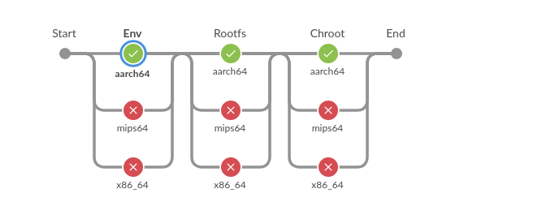

# Jenkins 流水线不中止步奏

## 忽略某一步错误继续执行下一步

### 1.使用 try ... catch 语句

```groovy
 try {
     stage('Env') {
         parallel x86_64: {
             node(label: "x86-builder-${env.OUTPUT_TYPE}") {
                 init_env()
                 call_ansible('env')
             }
         }, aarch64: {
             node(label: "arm-builder-${env.OUTPUT_TYPE}") {
                 init_env()
                 call_ansible('env')
             }
         }, mips64: {
             node(label: "mips-builder-${env.OUTPUT_TYPE}") {
                 init_env()
                 call_ansible('env')
             }
         }
	}
     catch (err) {
         dosomeing...
     }
```

### 2.使用 catchError 语句

```groovy
 stage('Env') {
     catchError(buildResult: 'SUCCESS', stageResult: 'FAILURE') {
         parallel x86_64: {
             node(label: "x86-builder-${env.OUTPUT_TYPE}") {
                 sh "echo env && exit 1"
             }
         }, aarch64: {
             node(label: "arm-builder-${env.OUTPUT_TYPE}") {
                 sh "echo env"
             }
         }, mips64: {
             node(label: "mips-builder-${env.OUTPUT_TYPE}") {
                 sh "echo env && exit 1"
             }
         }
     }
 }
```

该方式可以让该stage失败时不影响后续的stage的执行

