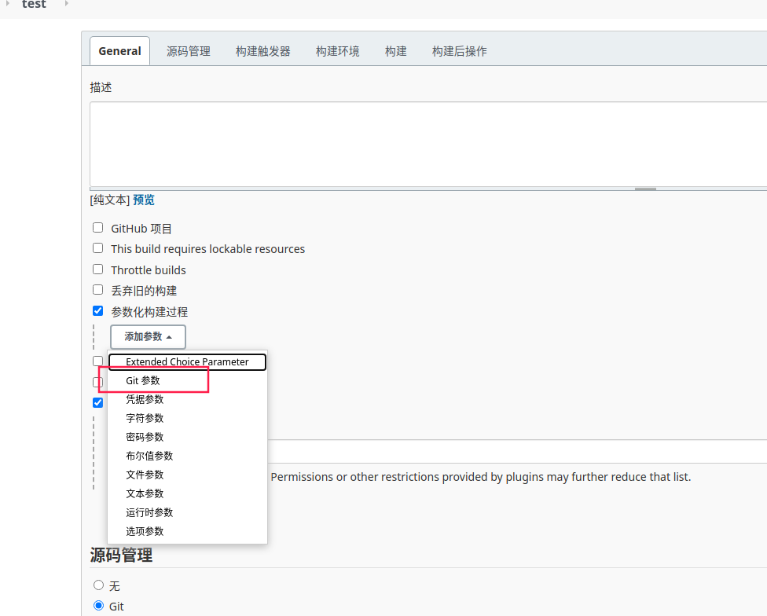
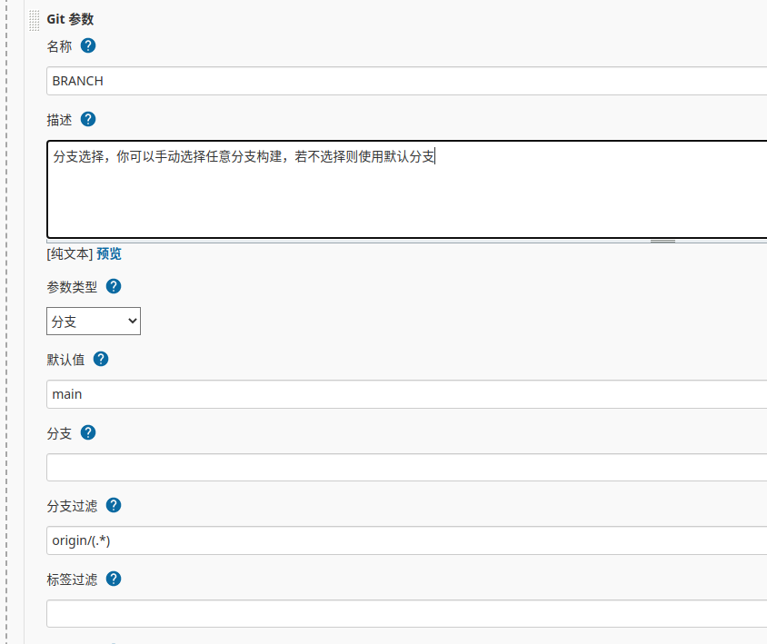
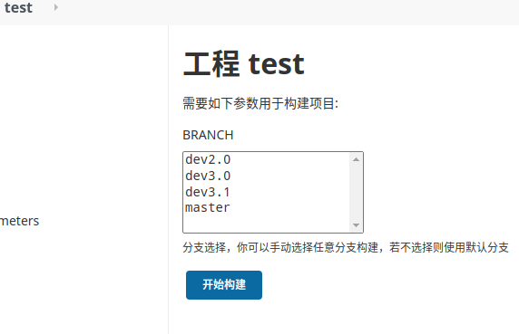

# Jenkins 选择分支构建

近期因为业务需要，需要在 `Jenkins` 构建时选择不同分支，现查阅资料得知，插件 `git parameter` 支持该功能，花了一点时间，搞好后，记录下来，便于后面使用时遗忘。

## 安装

首先，在插件管理里面，搜索 `git parameter` 插件，确保已经安装。

## 使用

1. 新建项目时，在配置界面勾选 参数化构建过程 --> Git 参数

2. 接着输入名称，该名称会自动作为环境变量保存，可以在 `pipline` 流水线中使用。注意填写默认分支，其它字段的描述可以点击帮助查看介绍。

3. 然后展开高级，在分支过滤一行，输入 `origin/(.*)` 内容，该内容主要是不展示 `origin/` 前缀，不然会默认展示为 `origin/main` 格式。

   

4. 在构建入口就可以看到分支选择界面

5. 最后就可以在 `pipline` 流水线中，使用 `${env.BRANCH}` 变量获取选择的分支了。