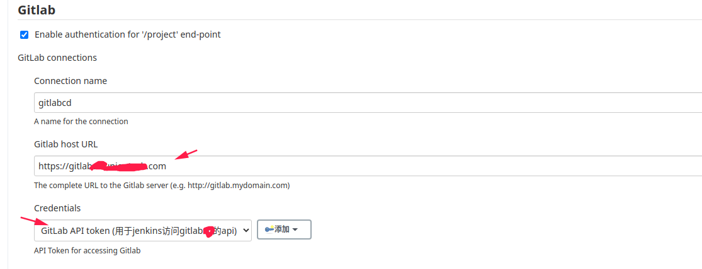

# gitlab触发jenkins构建

## 安装 jenkins 插件

## 插件配置

### 生成gitlab API

在登陆的用户界面，找到访问令牌，设置个人访问令牌，范围处勾选 `api`

在 `jenkins` 系统配置界面找到 `gitlab` 选项设置，注意 `Credentials` 处，选择的用户时，需要使用上面gitlab生成的 `token` 值

##参考链接

https://gitlabcd.uniontech.com/help/integration/jenkins