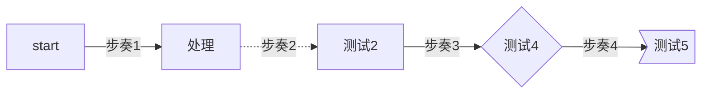
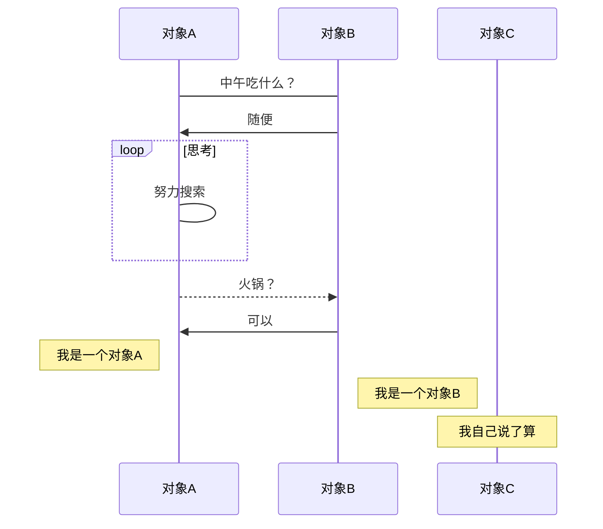
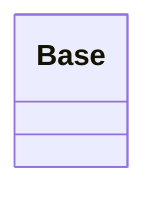
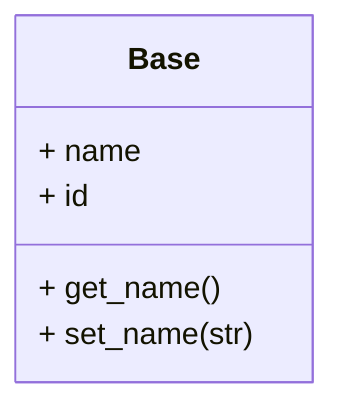
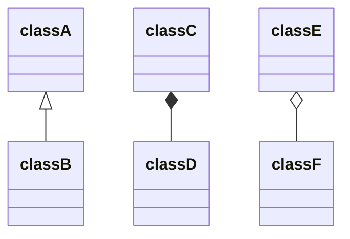
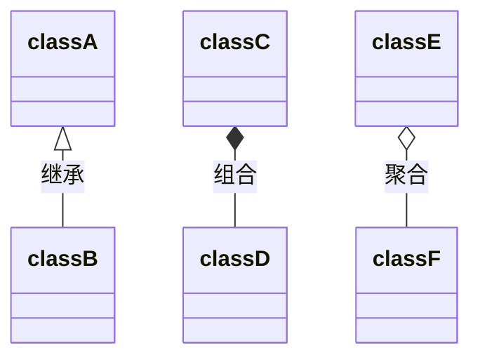
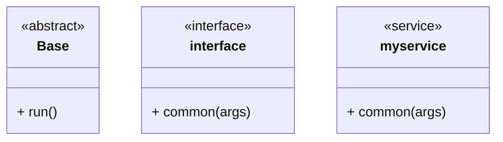

# MarkDown 绘制流程图、时序图

这些复杂图形的绘制都是使用代码块实现的，指定代码块的解析语言，按照响应的绘制语法即可实现。

- 流程图——指定 `mermaid`（样式流程图） 或 `flow` （标准流程图）解析语言
- 时序图——指定 `sequence`（标准时序图） 或 `mermaid`（样式时序图） 解析语言
- 甘特图——指定 `mermaid` 解析语言

## 一、流程图

### 1. 样式流程图

基本语法：

- `graph` 指定流程图方向：`graph LR` 横向，`graph TD` 纵向
- 元素的形状定义：
  - `id[描述]` 以直角矩形绘制
  - `id(描述)` 以圆角矩形绘制
  - `id{描述}` 以菱形绘制
  - `id>描述]` 以不对称矩形绘制
  - `id((描述))` 以圆形绘制
- 线条定义：
  - `A-->B` 带箭头指向
  - `A---B` 不带箭头连接
  - `A-.-B` 虚线连接
  - `A-.->B` 虚线指向
  - `A==>B` 加粗箭头指向
  - `A--描述---B` 不带箭头指向并在线段中间添加描述
  - `A--描述-->B` 带描述的箭头指向
  - `A-.描述.->B` 带描述的虚线连指向
  - `A==描述==>B` 带描述的加粗箭头指向

示例：




### 2. 标准流程图

基本语法：

- 定义模块 `id=>关键字: 描述` （“描述”的前面必须有空格，“=>” 两端不能有空格）
- 关键字：
  - `start` 流程开始，以圆角矩形绘制
  - `operation` 操作，以直角矩形绘制
  - `condition` 判断，以菱形绘制
  - `subroutine` 子流程，以左右带空白框的矩形绘制
  - `inputoutput` 输入输出，以平行四边形绘制
  - `end` 流程结束，以圆角矩形绘制
- 定义模块间的流向：
  - `模块1 id->模块2 id` ：一般的箭头指向
  - `条件模块id (描述)->模块id(direction)` ：条件模块跳转到对应的执行模块，并指定对应分支的布局方向

示例：

```flow
start=>start: 开始
info=>operation: 步奏一
cond=>condition: yes or no
inp=>inputoutput: 输出信息
end=>end: 结束

start->info->cond
cond(no)->info
cond(yes)->inp
inp->end


```


## 二、时序图

#### 1. 标准时序图

基本语法：

- `Title:标题` ：指定时序图的标题

- `Note direction of 对象:描述` ： 在对象的某一侧添加描述，`direction` 可以为 `right/left/over` ， `对象` 可以是多个对象，以 `,` 作为分隔符

- `participant 对象` ：创建一个对象

- `loop...end` ：创建一个循环体

- `对象A->对象B:描述`   ： 绘制A与B之间的对话，以实线连接
  - `->` 实线实心箭头指向
  - `-->` 虚线实心箭头指向
  - `->>` 实线小箭头指向
  - `-->>` 虚线小箭头指向

**示例：**

```sequence
Title:时序图示例
客户端->服务端: 我想找你拿下数据 SYN
服务端-->客户端: 我收到你的请求啦 ACK+SYN
客户端->>服务端: 我收到你的确认啦，我们开始通信吧 ACK
Note right of 服务端: 我是一个服务端
Note left of 客户端: 我是一个客户端
Note over 服务端,客户端: TCP 三次握手
participant 观察者
```
#### 2. 带样式时序图
基本语法同标准时序图，不同的是

需要使用 mermaid 解析，并在开头使用关键字 sequenceDiagram 指明
线段的样式遵循 mermaid 的解析方式
-> ： 实线连接
--> ：虚线连接
->> ：实线箭头指向
-->> ：虚线箭头指向

**示例：**



## 三、类图
使用 `mermaid` 类型，第一行跟上 `classDiagram` 关键字，表明是绘制类图。
### 定义一个类
显式的定义一个类可以使用引导词 `class` ，如定义一个名为 Animal的类： `class Base`



### 定义类成员

 mermaid 根据括号 （） 是否存在来区分属性和功能/方法. 具有 （） 的将被视为函数/方法，而其他则被视为属性。


### 定义类关系

面向对象编程中的类间关系有继承、组合、聚合等：

- <|--				继承
- *--                  组合
- o--                  聚合


### 类间关系上的标签

可以在关系定义后添加文本表示注释：


### 类注释

类的类型有以下四种，以 `<<` 和 `>>` 括起来：

- <<interface>> 接口类
- <<abstract>> 抽象类
- <<service>> 服务类
- <<enumeration>> 枚举类

## 参考链接

https://www.jianshu.com/p/6dbcc3aff98b

[绘制类图](https://blog.csdn.net/horsee/article/details/113883818)

[官方介绍mermaid](https://mermaid-js.github.io/mermaid/#/)

[语法介绍](https://segmentfault.com/a/1190000041781220)