# 使用nessus进行安全漏洞扫描

## 下载
下载较慢，请提前做好翻墙准备 [下载链接](https://www.tenable.com/downloads/api/v1/public/pages/nessus/downloads/12207/download?i_agree_to_tenable_license_agreement=true)

## 安装
- 将下载的离线包，安装到需要扫描的机器上
```bash
test@test-PC:~$ sudo dpkg -i Nessus-8.13.1-debian6_amd64.deb 
正在选中未选择的软件包 nessus。
(正在读取数据库 ... 系统当前共安装有 54001 个文件和目录。)
准备解压 Nessus-8.13.1-debian6_amd64.deb  ...
正在解压 nessus (8.13.1) ...
正在设置 nessus (8.13.1) ...
Unpacking Nessus Scanner Core Components...
Created symlink /etc/systemd/system/nessusd.service → /lib/systemd/system/nessusd.service.
Created symlink /etc/systemd/system/multi-user.target.wants/nessusd.service → /lib/systemd/system/nessusd.service.

 - You can start Nessus Scanner by typing /bin/systemctl start nessusd.service
 - Then go to https://test-PC:8834/ to configure your scanner
```
- 接着，启动服务
```bash
test@test-PC:~$ sudo systemctl start nessusd.service
test@test-PC:~$ sudo systemctl status nessusd.service
● nessusd.service - The Nessus Vulnerability Scanner
   Loaded: loaded (/lib/systemd/system/nessusd.service; enabled; v
   Active: active (running) since Fri 2021-02-05 15:05:54 CST; 17m
 Main PID: 2949 (nessus-service)
    Tasks: 12 (limit: 4915)
   Memory: 5.8G
   CGroup: /system.slice/nessusd.service
           ├─2949 /opt/nessus/sbin/nessus-service -q
           └─3475 nessusd -q

2月 05 15:05:54 test-PC systemd[1]: Started The Nessus Vulnerabili
lines 1-11/11 (END)
```
## 登录配置
1. 打开任意浏览器，输入`https://10.8.0.117:8834/`，其中ip地址需替换为自己安装的ip地址，回车
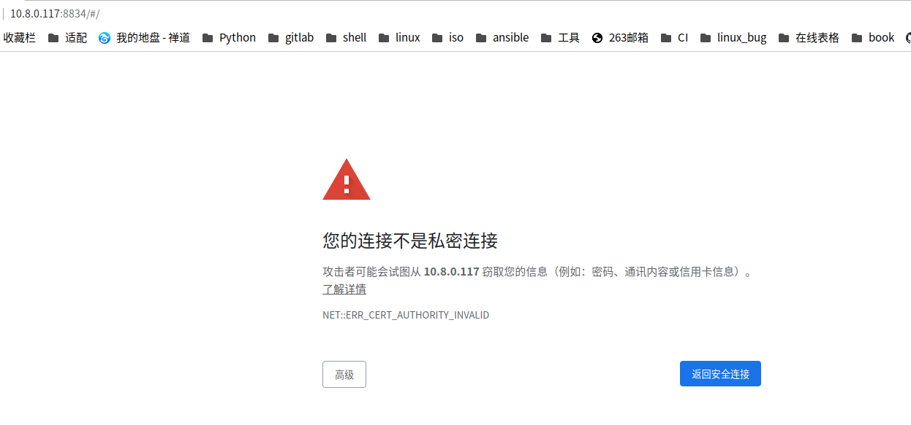
2. 选择高级，继续访问，来到nessus的欢迎界面，选择第一个  
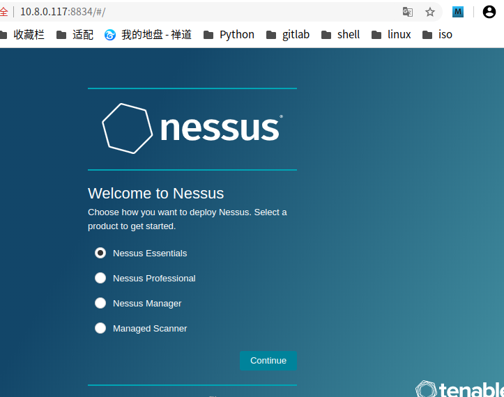
3. 填写邮箱地址，用来获取激活码  
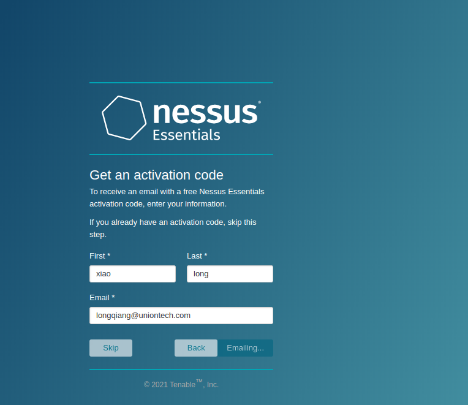
4. 填入收到的激活码，我本次激活码：`72A2-4A48-1347-8E10-B813`  
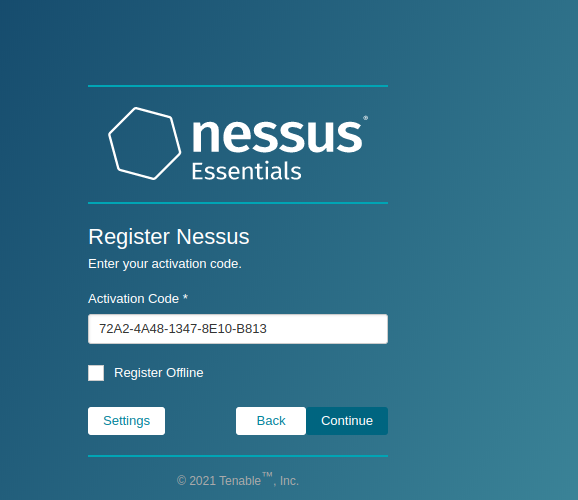
5. 创建登录平台的用户名及密码，此处，我填写了平台统一密码账户：devops  密码：Unit@123  
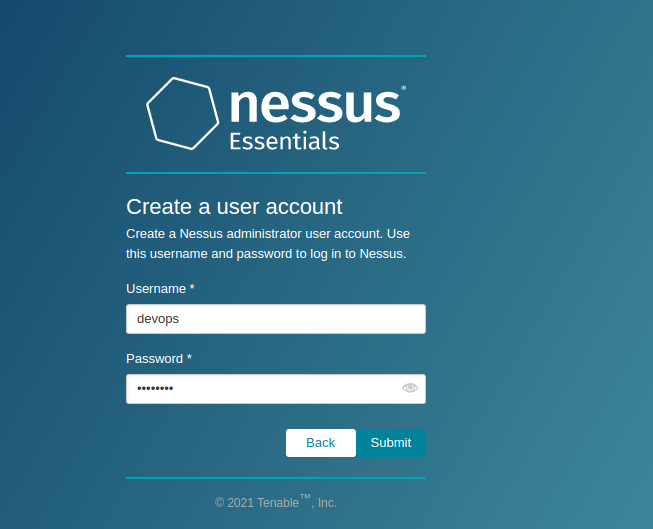
6. 接着，进入平台初始化过程，等待即可  
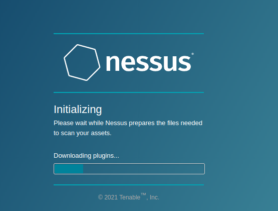


## 配置扫描节点
1. 进入主页后，点击新建按钮
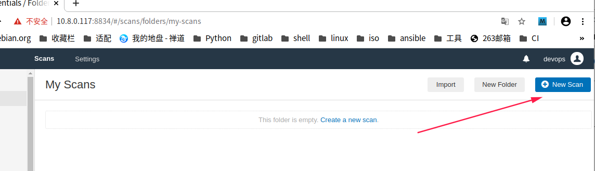
2. 选择基础网络扫描
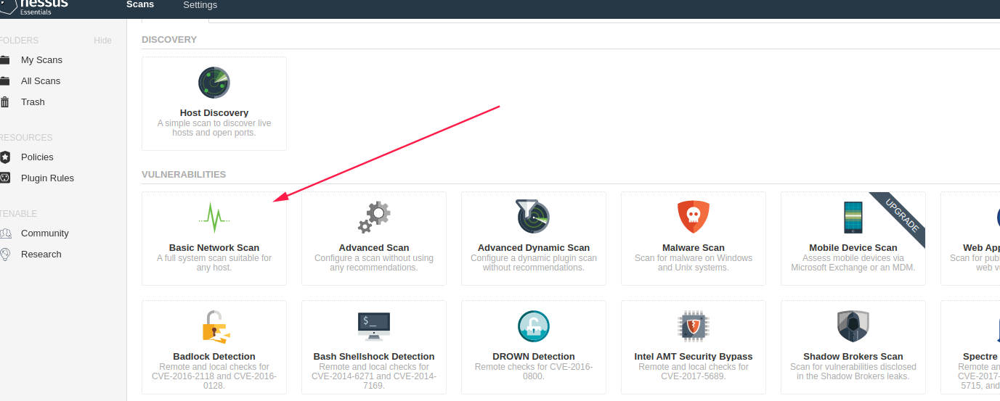
3. 填写需要扫描的节点信息 （节点需要安装ssh）
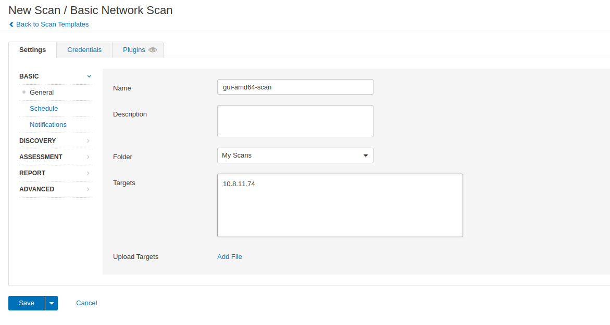
4. 点击Credentials，设置ssh验证方式，本次使用了账户密码的方式
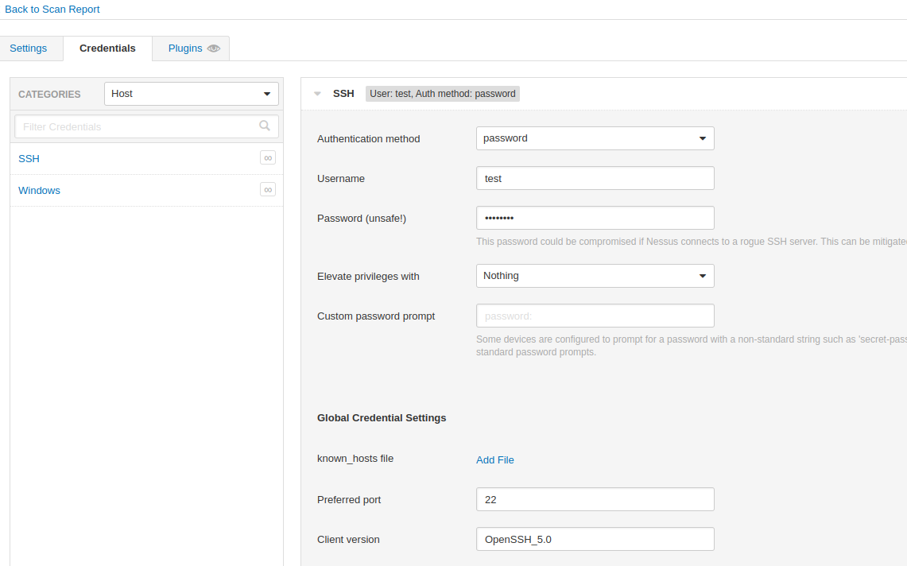
5. 点击保存，则会自动跳转到My Scans主页
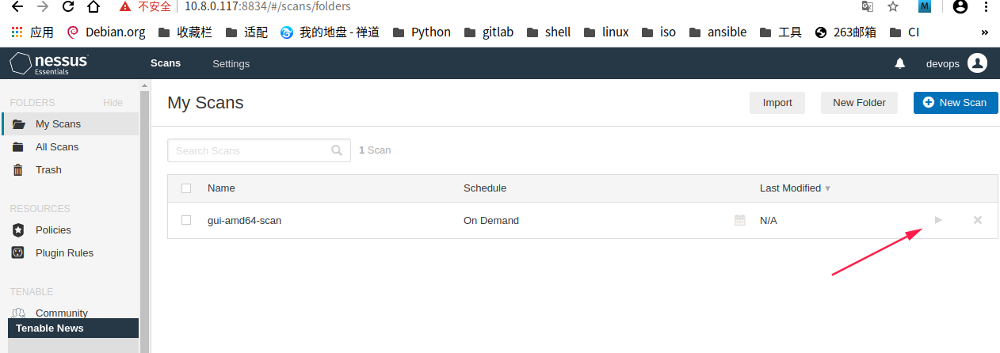
## 开始扫描
1. 点击启动按钮后，点击当前条目，可以看到实时信息，扫描结果如下
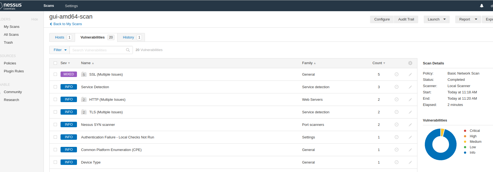
2. 点击其中，关注的信息，即可看到更详细的情况
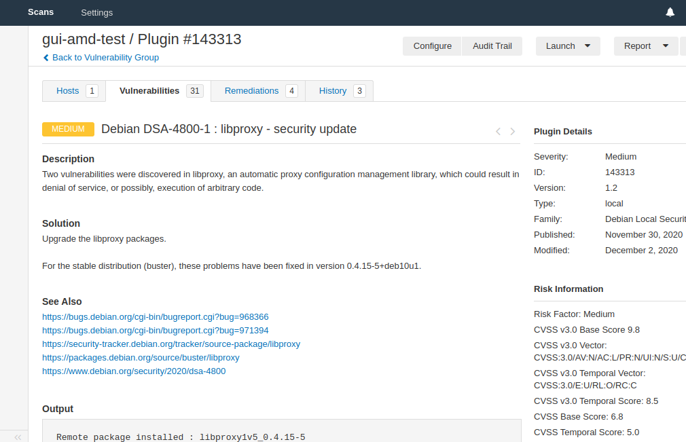


