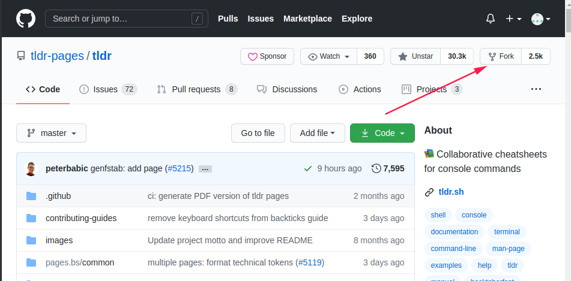
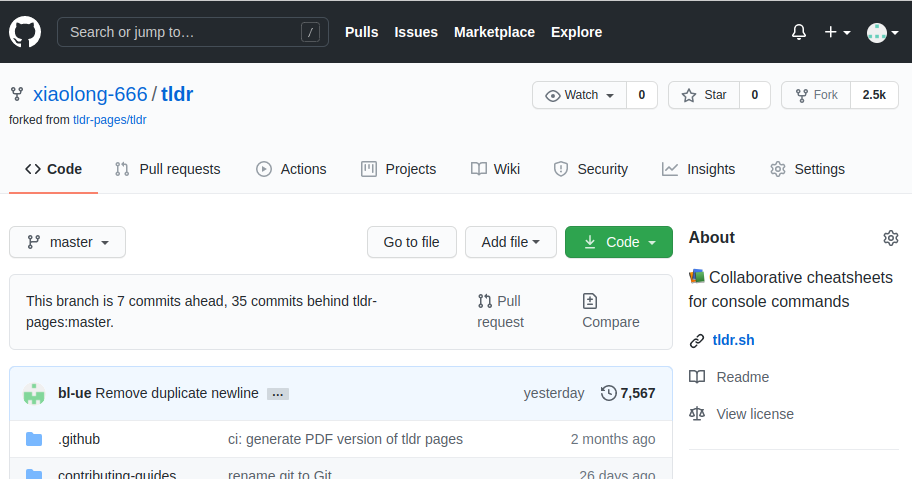
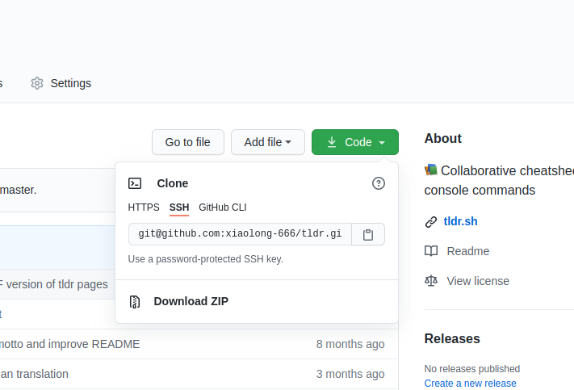
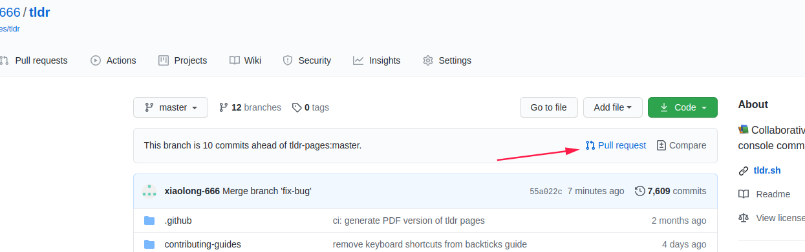
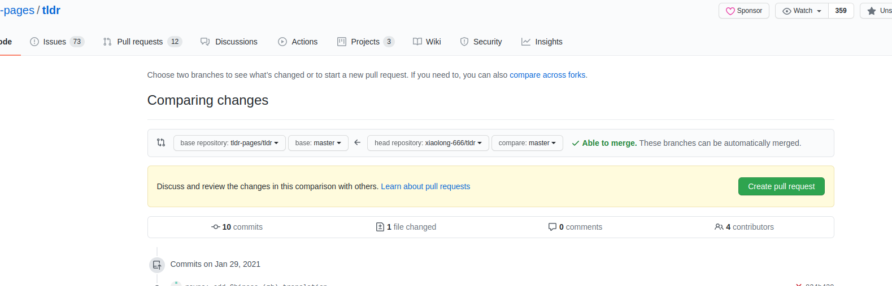
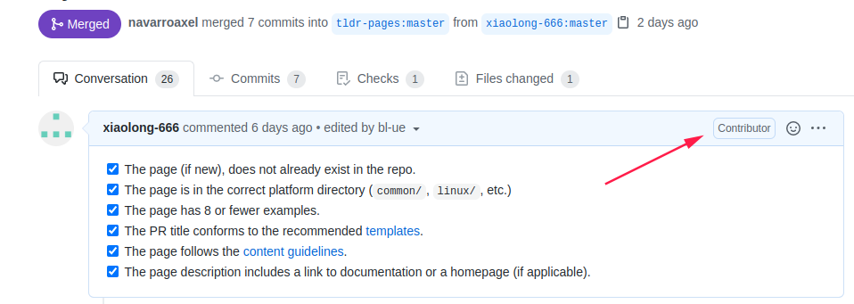

# 如何PR

## 基本概念
### 什么是复刻（forking）？
我们可以通过Fork操作，将自己喜爱的仓库保存在自己的GitHub账户中，以便独立地对其进行操作。
通过Fork，我们可以得到目标仓库的所有版本历史的示例，可以对Fork的仓库进行任意操作而不会影响到原始仓库。

### 什么是拉取请求PR（pull request）
拉取请求是为团队项目或开源项目做贡献的一种方式。

## 为开源项目做贡献
为开源做贡献，不一定是解决了重大bug，可以很小，小到每个人都能为开源贡献一份力量。比如标点符号、翻译错误、完善项目文档之类的都算。
所以不要畏惧开源，积极拥抱，你会发现开源也没那么难，当你贡献一次后，在该项目中，你会发现你拥有一个Contributors标签！

###  创建第一个拉取请求
#### 1. 复刻仓库
找到你感兴趣的项目，点击页面的`Fork`按钮即可，这将会在你的账户中创建此仓库的完整实例

Fork后，在自己账户中查看，如图：

#### 2. 克隆仓库
现在自己的账户中已经包含了这个仓库，将它克隆到本地进行编辑，点击`clone`按钮，复制如下链接，推荐使用ssh方式

打开本地终端，将上面复制的链接，使用`git clone`命令克隆到本地
```bash
git clone git@github.com:xiaolong-666/tldr.git
```
#### 3. 同步上游原始代码仓库
向原始仓库提交拉取请求之前，确保本地代码跟上游原始仓库保持一致，应该时刻同步。
- 进入本地仓库目录，将原始仓库添加为upstream仓库
```bash
git remote add upstream git@github.com:tldr-pages/tldr.git
```
- 添加完毕后，可以使用`git remote -v`命令查看远程仓库
```bash
% git remote -v
origin  git@github.com:xiaolong-666/tldr.git (fetch)
origin  git@github.com:xiaolong-666/tldr.git (push)
upstream        git@github.com:tldr-pages/tldr.git (fetch)
upstream        git@github.com:tldr-pages/tldr.git (push)
```
- 获取原始仓库的变更，同步
从原始仓库获取变更，所有提交到原始仓库的变更将会保存在本地的upstream/master分支中
```bash
% git fetch upstream
remote: Enumerating objects: 163, done.
remote: Counting objects: 100% (163/163), done.
remote: Compressing objects: 100% (3/3), done.
remote: Total 296 (delta 160), reused 162 (delta 160), pack-reused 133
接收对象中: 100% (296/296), 113.75 KiB | 22.00 KiB/s, 完成.
处理 delta 中: 100% (198/198), 完成 76 个本地对象.
来自 github.com:tldr-pages/tldr
 * [新分支]            add-parted                       -> upstream/add-parted
```
- 合并变更
将upstream/master分支中的变更合并到本地的master分支，这样就能够做到让本地的master分支与原始仓库保持同步。
```bash
% git merge upstream/master 
Merge made by the 'recursive' strategy.
 MAINTAINERS.md                         |  6 ++++--
 README.md                              |  5 ++++-
 contributing-guides/style-guide.md     |  7 +++++++
```

#### 3. 创建分支-解决问题
git鼓励创建分支来解决问题，不管是小项目还是团队协作的项目，使用仓库时，都最好新建立一个分支。分支名称应该简短，能够反应我们所做的工作。
使用`git checkout -b`命令来创建一个分支, 并切换

```bash
git checkout -b fix-bug
```
接下来，你就可以在当前分支为所欲为了
完毕后，记得`git commit -m 'xxxxxx'`

#### 4. 提交代码到自己账户的远程仓库
注意，因为指定了上游的远程仓库，所以不能使用默认的`git push`命令，需要指定仓库及推送的新分支
```bash
% git push origin "new_branch" 
枚举对象: 7, 完成.
对象计数中: 100% (7/7), 完成.
使用 16 个线程进行压缩
压缩对象中: 100% (4/4), 完成.
写入对象中: 100% (5/5), 518 bytes | 518.00 KiB/s, 完成.
总共 5 （差异 2），复用 0 （差异 0）
remote: Resolving deltas: 100% (2/2), completed with 2 local objects.
To github.com:xiaolong-666/tldr.git
   cee55002..55a022c7  master -> master
```
#### 5. 在github上发起PR请求
进入提交的项目主页面，找到`Pull request`按钮

点击后会自动跳转到上游项目中，请提供必要的说明来介绍你做的变更，确认后提交拉取请求


**至此，恭喜你！你已经成功创建了一个PR请求！**

但是，想要成功被上游采纳，还没这么简单。拉取请求后，请注意查看PR页面中的详细信息，比如一下构建错误、或格式要求，以及开发者指出的意见。一次没过，在自己本机按照要求修改后，再次push到你自己的仓库即可。
不需要再次发起PR，默认会在已发起的PR下面，添加提交记录。你可以反复修改，直到满足上游代码合并的要求。当合入后，你在该项目中，会有一个contributor标签！
