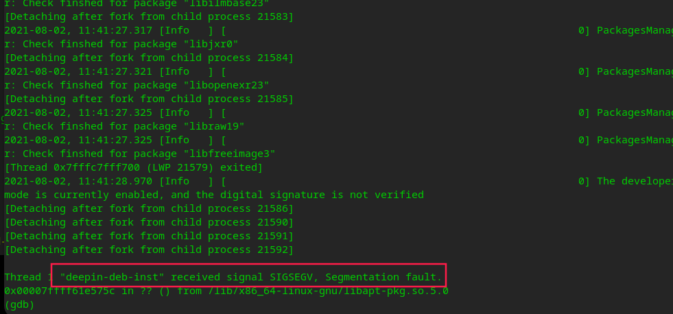
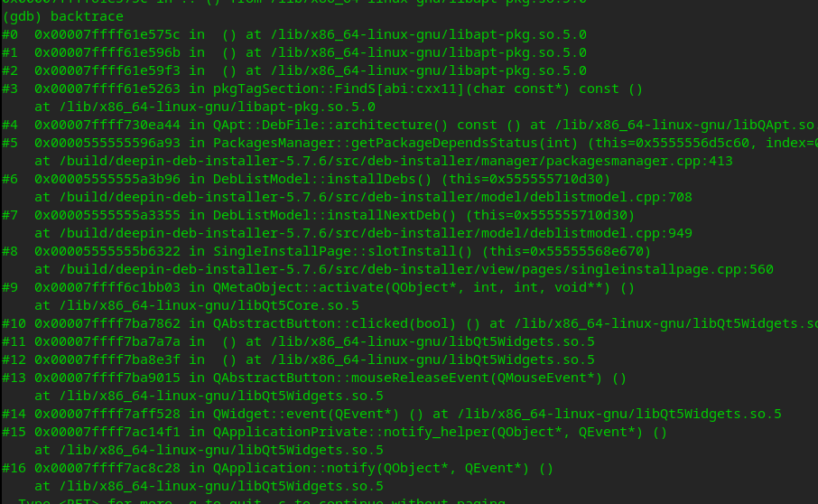
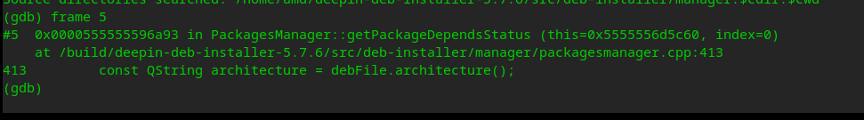

# gdb 调试

gdb 调试是在Linux下排查问题的不二神器，此处仅仅是使用一点皮毛，来记录我在使用中，如何来分析程序执行时的段错误信息。

gdb从仓库安装即可：
```bash
apt install gdb
```

## 安装程序的调试包
比如此处的deepin-deb-installer程序，在专用设备1020系统中，运行提示段错误信息，从日志分析，只看到了段错误字段，没有其它多余信息，无法定位。
从仓库安装，对应软件的调试包信息
```bash
apt install deepin-deb-installer-dbgsym
```

## 调试
使用`gdb deepin-deb-installer`即可调试该程序：
```bash
amd@amd-PC:~$ gdb deepin-deb-installer
GNU gdb (Uos 8.2.1.1-1+security) 8.2.1
Copyright (C) 2018 Free Software Foundation, Inc.
License GPLv3+: GNU GPL version 3 or later <http://gnu.org/licenses/gpl.html>
This is free software: you are free to change and redistribute it.
There is NO WARRANTY, to the extent permitted by law.
Type "show copying" and "show warranty" for details.
This GDB was configured as "x86_64-linux-gnu".
Type "show configuration" for configuration details.
For bug reporting instructions, please see:
<http://www.gnu.org/software/gdb/bugs/>.
Find the GDB manual and other documentation resources online at:
    <http://www.gnu.org/software/gdb/documentation/>.

For help, type "help".
Type "apropos word" to search for commands related to "word"...
Reading symbols from deepin-deb-installer...Reading symbols from /usr/lib/debug/.build-id/96/0dfa98adb36576e68bb363dc6abea1317eca0f.debug...done.
done.
(gdb) 
```
接着输入`run`命令即可启动程序，然后在程序中操作即可。

如果发生了段错误，gdb 会打印出抛出段错误的地址和来源


使用`traceback`可以查看调用堆栈


使用`frame 5`可以切换到感兴趣的堆栈，查看具体是哪行代码出错

如果提示找不到源码，可以先使用`apt source deepin-deb-installer`命令下载源码，然后在gdb中，使用`dir /home/amd/deepin-deb-installer-5.7.6/src/...`添加源码目录，即可看到源码信息了。


##参考链接

- [使用gdb调试段错误](https://blog.csdn.net/Deutschester/article/details/6739861)
- [gdb调试解决找不到源代码的问题](https://blog.csdn.net/albertsh/article/details/107437084)

