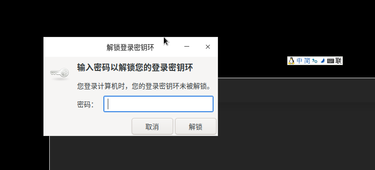

# lightdm自动登陆
通过修改lightdm配置文件即可达到开机自动登陆目的
## 创建自定义的配置文件
创建`/etc/lightdm/lightdm.conf.d/`目录，该目录用来存放自定义的配置文件，避免因为版本升级导致全局配置恢复默认值

在该目录中执行以下命令：
```bash
cat > /etc/lightdm/lightdm.conf.d/01-my-custom.conf << EOF
[SeatDefaults]
autologin-user=${USERNAME} # 跳过用户的名称
EOF
```
## 解决进入系统后弹出解锁密钥环提示
如果进入系统后，提示解锁登陆密钥环，如图：

只需要手动删除已有的缓存：`rm -rf ~/.local/share/keyrings`即可