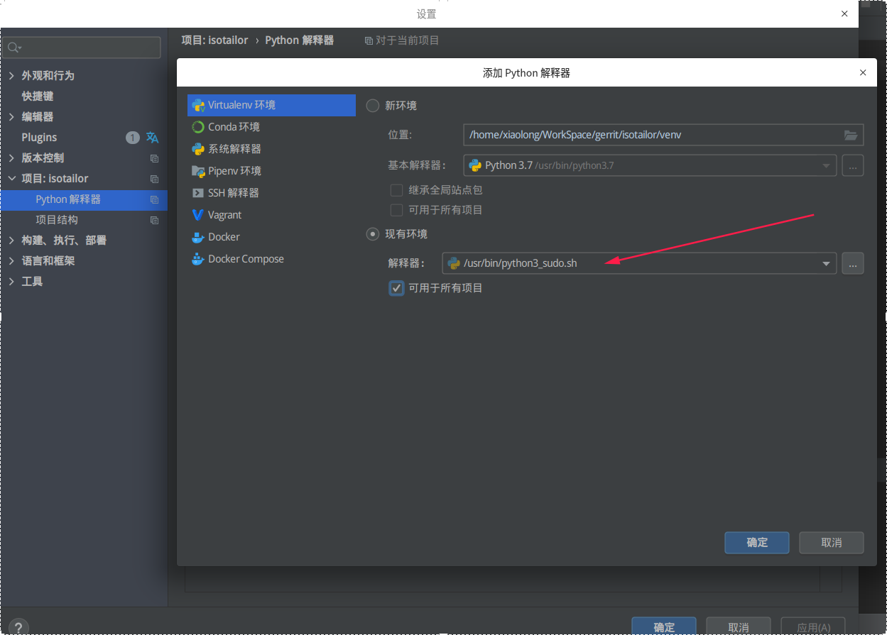
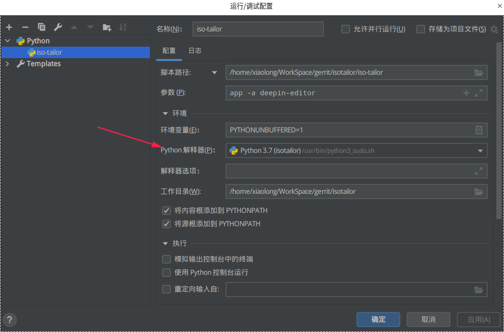

# pycharm中以root用户运行Python脚本
最近开发中，经常需要以root用户执行python脚本，而pycharm是调试的python的好工具，直接调试遇到需要提权的直接就结束了。又不想以root用户来启动pycharm，最终找到了完美解决方案

## 设置Python解释器默认以sudo方式启动，且免密码
```bash
sudo visudo -f /etc/sudoers.d/python3
```
> 注意用visudo来编辑sudoers.d中的文件，它具有安全检查功能。使用vim等其他编辑器可能导致文件配置失败，无法使用sudo命令，出现sudo解析失败,无法初始化策略插件错误

在文件中输入以下内容(注意替换你自己的用户)：
```bash
xiaolong ALL = (root) NOPASSWD: /usr/bin/python3
```
## 创建一个脚本文件，以sudo方式启动Python解释器
创建脚本文件python3_sudo.sh，内容如下：
```bash
#!/bin/bash
sudo /usr/bin/python3 "$@"
```
增加可执行权限
```bash
chmod a+x python3_sudo.sh
```
**建议将该脚本放置到/usr/bin目录下**

## 在pycharm中设置为python3_sudo.sh为项目解释器
打开项目，选中设置页面，设置项目的python解释器为自己编写的脚本即可

保存后，在项目的运行/调试配置界面，python解释器一栏选中刚才添加的解释器即可


最后，运行python项目，没有root权限的问题就解决了！


