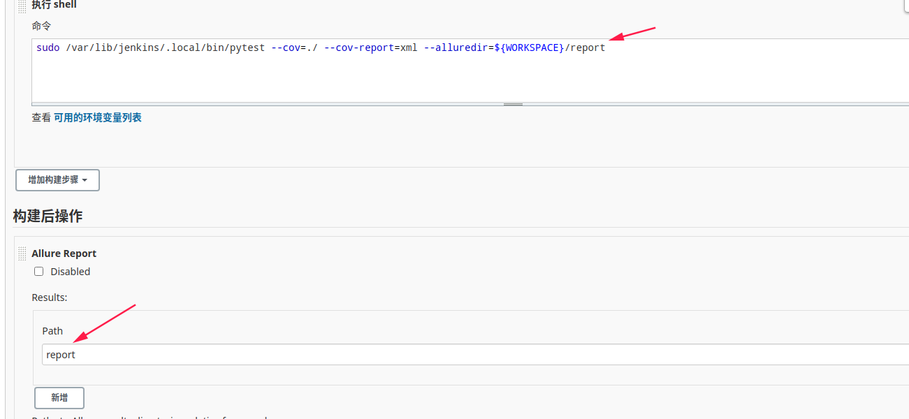

# Pytest + Allure + Jenkins

Allure是一款非常轻量级并且非常灵活的开源测试报告生成框架。它简单易用，易于集成，并且支持绝大多数测试框架， 例如TestNG、Pytest、JUint等。

## 安装

```bash
pip3 install pytest allure-pytest pytest-cov
```

Jenkins上直接在插件管理里面，搜索`Allure`安装即可


## 配置

在job配置页面，注意箭头所指的路径，需要保持一致即可

然后构建项目，成功后，会在页面看到`allure`标志，点击即可看到详情


tips:

第一次执行，不要使用root权限来操作，创建的文件导致后续导出报告时，没有权限。若测试需要root权限，也要先用普通的jenkins用户执行一次后，在使用sudo权限操作。

**root用户慎用！！！权限问题，导致好多莫名现象**

## 参考链接

[Jenkins + Pytest + Allure](https://www.cnblogs.com/detector/p/9058497.html)

